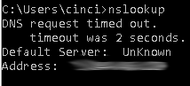
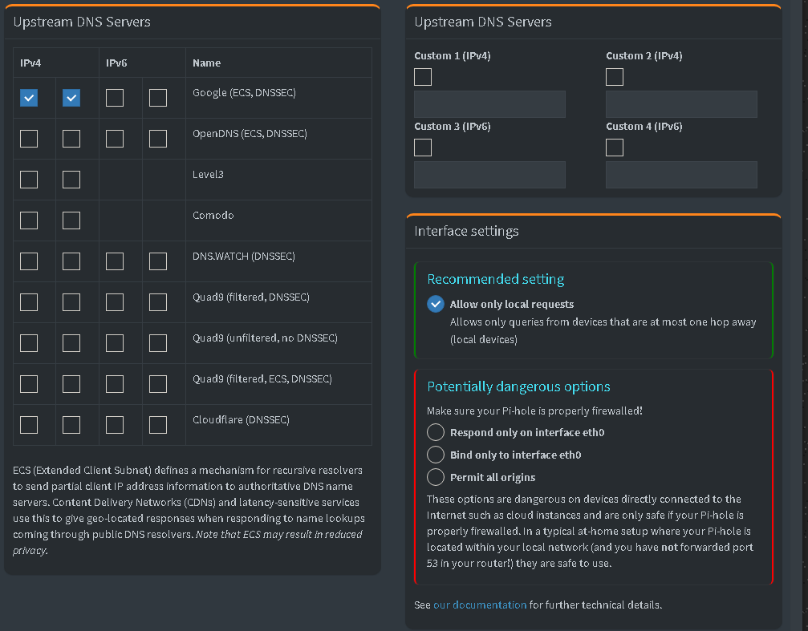
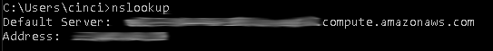
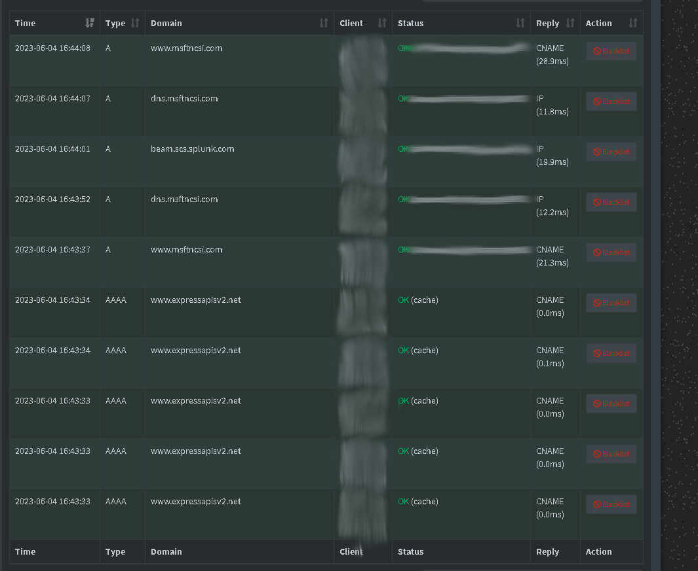

# Step by step process for creating free AWS Pi-hole

This guide will teach you how manually setup your own free Pi-hole using an AWS server. I've also left in the speed bumps encountered along the way, as they may help with any issues you possibly run into while doing it yourself. 

1. Navigate to AWS EC2 Management console.

2. Set zone as closest to your physical location in order to reduce latency. In AWS, you can create multiple instances in different locations, which would serve a number of different purposes. 

3. From the AWS Services, navigate to the EC2 home page and click "Launch Instance".

4. Name your instance and select your desired operating system.

5. Choose your instance size.  There are a variety of instance sizes, many of which are free. Select the t2.micro with 1vCPU and 1gb of ram. This sufficient to run our Ubuntu server and Pi-hole, and free!

6. We can skip past the network settings for this, keeping SSH traffic through port  /22 allowed from any IP. However if this were something with sensitive information, we would want to configure this with rules and restrictions as to who can connect to our EC2 instance. We do need to add a couple of rules though; click add rule and choose DNS (TCP), then again for DNS (UDP), and once again for HTTP. HTTP has a default source address of 0.0.0.0/0. This tells the firewall to accept all connections, which is typical behavior for HTTP web servers. This can be left the same or set to your IP (if it's static). The DNS sources can either contain your static IP, IP address of your VPN host if you are using one, or it can be left open like HTTP. 

7. Once satisfied with all of your security rules, you can now click "Launch page". After doing this, you'll notice a popup asking to create your private key. It's best practice to make a different private key for each server you create in the future. For now, let's call ours (yourname_awspihole). We can keep this as RSA, and .pem for SSH. Click "Create key pair", this will download your key and you can now move it to the desired folder on your computer. Now click "Launch instance" again, and you will see your server being created. Click on your new instance id, and you will be see your serverse Public IPv4 address, make notation of this. (X.XXX.XX.XXX).

8. Now, open up the command line on your desired computer that you'd like to SSH access into your server from. You must also remember to make sure your .pem file is present on the machine you wish to use. (I personally emailed my private key to my ubuntu machine, which is probably not the smartest move with something more sensitive and secure, but this was just for the purpose of this exercise). After entering the command to join your server, you'll be prompted to accept the servers unique signature. Your machine uses this to protect you from Man-In-The-Middle attacks, preventing you from mistakenly connecting to rogue servers and divulging other information. Now type in;                                                                                                                        

        ssh -i /pathtofile/yourname_awspihole.pem ubuntu@*yourserveripv4*                                
        
        
   Ran into an issue myself when trying to ssh into the server from my ubuntu machine... 

        Permissions 0664 for '/home/christian/.aws/credentials/christian_awspihole.pem' are too open.  
        It is required that your private key files are NOT accessible by others.                                                  
        Load key "/home/christian/.aws/credentials/christian_awspihole.pem": bare  permissions                 
        ubuntu@x.xxx.xx.xxxx: Permission denied (publickey).                                                                           
    If you receive this issue, you need to change permissions to read only, and only for the owner of the key. File needs to be locked for every other user. Your AWS server will have a 172.xx.xx.xx hostname, which is it's pulblic facing IP, but it's also part of the AWS network. This means that other AWS services you will create can freely talk to eachother without being exposed to the internet.                                                         

9. Before setting up Pi-hole, it's best practice to take care of some fundamental steps. We will be running;

        sudo apt update
        sudo apt upgrade -y 

   Your server will update itself automatically, but it's best to have these practices under your belt. Now let's also change our hostname to something more descriptive. You can choose anything you'd like, but why not make it something more descriptive of what we're doing?                            
   
        sudo hostnamectl set-hostname AWS_Pihole

10. Now it's time to get Pi-hole! The following command will grab the official Pi-hole installer to begin. It's not best practice to use a curling shell script straight to bash like this to bash, because it's not a secure method. However we're working on a free machine that we can easily scrap if anything goes awry. Typically it's best to go to the Pi-Hole site and follow the official instructions.  

        sudo curl -sSL https://install.pi-hole.net | bash                                                                                         
    Continue through the setup window until asked to select your Upstream DNS provider. The DNS works by reaching out to the DNS Server when your Pi-hole can't connect the URL you want to go to with an IP address. Any of the listed selections are great choices, however I prefer Google or Cloudfare. Either way, you can't go wrong, and you can also change later from the web interface.

11. Next, choose your Ad Blocker lists. Either choice is fine, once again, don't sweat this choice! Also, you can add more later in the web interface! Now, we click "OK" to install the web admin interface, and do the same to hit "Yes" to install the compact web server. Do the same on the next page when asked if you would like to enable query logging. This is an easy yes, we want to log as much as possible! This helps us analyze to logs in order to isolate ads that slip through Pi-hole in order to blacklist them. Lastly, when asked about your privacy mode, we can go ahead and select "show everything" for the purpose of setting up our practice Pi-hole, since it's our personal system.

12. Your AWS Pi-hole will now finalize it's setup. Once this is complete, you will be presented with a screen giving  you the web address to the admin interface and it's temporary password. (web interface address is http://pi.hole/admin or http://xxx.xx.x.xxx/admin, temporary Admin password is xxxxxxx).

13. We can now change the temporary password if you'd like to! Run the command "pihole -a -p", then enter you're new password and you're almost done setting up your Pi-Hole!

14. It's time to wrap up your ssh into your server and then we can move on to your Pi-hole Management Console!. Let's go ahead and type "exit" in your terminal to close out our aws server, and head to the web interface! Type in your url and let's get started.

15. Connecting to your home network; As long as your have a router with DHCP enabled, you can enter the address of your Pi-hole in the DNS settings of your router and devices that connect via DCHP will automatically look at your Pi-hole for DNS services. Secondly, you could add the Pi-hole IP address to your devices locally. This an be entered in your network adapter properties. By changing this DNS, it adds a layer of privacy from your ISP. Go ahead and change your DNS server settings on your local computer to the public IP address of your AWS server. You can do this by going to;

    Network settings > Change Adapter Options > Right click on Your Network Adapter > Properties > highlight Internet Protocol Version 4 (TCP/IPv4) > click Properties again > enter your public facing IP of your AWS server into Preferred DNS server > select any other desired DNS server for your Alternate DNS server (personally I chose Googles DNS for my alternate).                                                                                  
16. Now here's where it got fun! I personally wasn't able to     connect to my Pi-hole web console from by searching the URL. Turns out, the issues was that I did in fact need to go back into the AWS Instance, and change some security rules. I first, searched "what is my ip address" in google, and noted down my Public facing IP. Then I needed to edit the inbound traffic rules in my security group to allow traffic to each protocol form my specific IP address. Once I had set these, I was able to login to my Pi-hole Web Management Console, but the issues weren't done there! I ran into some roadblocks when attempting to use Pi-hole to view my DNS query log from Pi-hole. First, it wasn't enough to only set the DNS in my local machine, but I also had to set it in my router. Seems as if it was causing an error from trying to use two different DNS servers. But even after this, was still not having any luck showing any DNS requests in the query log!      Did an nslookup in the command line (I've hidden all ip addresses in the following images for privacy reasons), and this resulted in a "DNS request timed out."         

                                                                                                                         
    Time to dig further! I took a look at the DNS settings in Pi-Hole; turns out I needed to adjust some settings in here!

       

    Under Interface settings, "Allow Only Local Requests" was blocking dns requests outside of my local network, so make sure to take a look at this when setting up your Pi-hole! I changed this to Permit All Origins under the Potentially Dangerous Options setting. Proceeded to do another nslookup command, and here are the results;     

                                                           

    We can now see all DNS requests coming from our network in the query log!
      
    
    